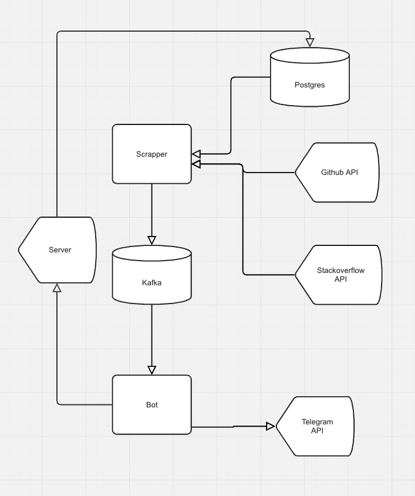

# LinkTracker

It is project from course of Academy Backend T-bank

## Description

This is telegram bot for tracking of updates on github repos or stackoverflow questions. This project uses fastapi to write an api, telethon to write telegrams bot, async postgresql as a database for data storage, kafka for asynchronous interaction, and redis for caching.


## Scheme 


## To start bot
Firstly you need pass credentials in .env, as example .env.example

`make services` -- to start db, kafka and redis

`make bot` -- to start tg bot

`make server` -- to start server

`make scrapper` -- to start scrapping(find updates and send notification)
## dev commands
`docker compose up pg` -- поднять бд

`alembic revision --autogenerate -m "Create chat and link tables"` -- создать миграцию

`alembic upgrade head` -- применение миграции

# For developing

## Table of Contents

- [Requirements](#requirements)
- [Setup](#setup)
- [Running the Project](#running-the-project)
- [Testing](#testing)
- [Linting](#linting)
- [Useful Commands](#useful-commands)
- [Contributing](#contributing)
- [License](#license)

## Requirements

To work with this template, you'll need the following installed:

- **Python 3.11+**: Ensure Python is installed and available in your PATH.
- **Poetry**: Dependency management tool for Python. You can install it via:

```bash
curl -sSL https://install.python-poetry.org | python3 -
```

## Setup

1. **Install dependencies:**

   ```bash
   make install
   ```

2. **Activate the virtual environment:**

   Poetry automatically creates a virtual environment for your project. To activate it:

   ```bash
   poetry shell
   ```

## Running the Project

To start the application, use the following command:

```bash
make bot
```

In another terminal start server
```bash
make server
```

## Testing

The project includes a basic test suite. To run tests, use:

```bash
make test
```

## Linting

Ensure your code meets the style guidelines:

```bash
make lint
```

## Useful Commands

Here are some commands you might find useful during development:

- **Add a new package:**

  ```bash
  poetry add <package-name>
  ```

- **Add a new development package:**

  ```bash
  poetry add --dev <package-name>
  ```

- **Update dependencies:**

  ```bash
  poetry update
  ```

- **Run the application:**

  ```bash
  poetry run python -m src.main
  ```

- **Run tests:**

  ```bash
  make test
  ```

- **Run linters in format mode, possibly fixing problems:**

  ```bash
  make format
  ```

## License

This project is licensed under the MIT License. See the [LICENSE](LICENSE) file for details.
